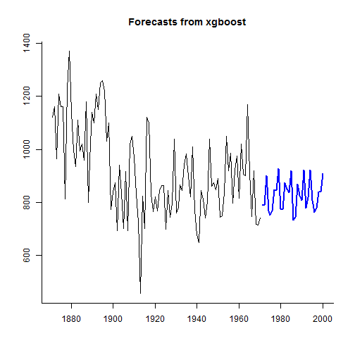

# forecastxgb-r-package
An R package for time series models and forecasts with xgboost compatible with {forecast} S3 classes

[](https://travis-ci.org/ellisp/forecastxgb-r-package)
[](http://www.r-pkg.org/pkg/forecastxgb)
[](http://www.r-pkg.org/pkg/forecastxgb)

Only on GitHub.  Very early days, still needs some thorough testing.  

This implementation uses as features lagged values of the target variable, linear time, and dummy variables for seasons.


```r
devtools::install_github("ellisp/forecastxgb-r-package/pkg")
```

## Usage


```r
library(forecastxgb)
model <- xgbts(AirPassengers)
```

```
## Starting cross-validation
```

```
## Stopping. Best iteration: 53
```

```r
fc <- forecast(model, h = 12)
accuracy(fc)
```

```
##                        ME       RMSE        MAE          MPE       MAPE
## Training set 0.0002562205 0.05605459 0.04106102 -0.000771816 0.01542937
##                     MASE       ACF1
## Training set 0.001281943 -0.1735931
```

```r
plot(fc)
```


## Tourism data example

```r
library(Tcomp)

thedata <- tourism[[1]]

x <-thedata$x
h <- thedata$h

model <- xgbts(x)
```

```
## Starting cross-validation
```

```
## Stopping. Best iteration: 20
```

```r
summary(model)
```

```
## 
## Importance of features in the xgboost model:
##     Feature         Gain        Cover   Frequence
##  1:   lag12 8.016497e-01 0.3451624953 0.162420382
##  2:   lag24 1.918121e-01 0.1087037729 0.054140127
##  3:   lag18 1.013708e-03 0.0347403810 0.038216561
##  4:   lag15 7.880685e-04 0.0531938737 0.063694268
##  5:    time 7.229844e-04 0.0484871124 0.057324841
##  6:    lag8 6.108096e-04 0.0251027269 0.028662420
##  7:    lag1 4.510619e-04 0.0372058274 0.108280255
##  8:    lag2 4.333133e-04 0.0328726186 0.070063694
##  9:    lag6 4.100177e-04 0.0169592828 0.035031847
## 10:    lag4 2.899116e-04 0.0103847591 0.035031847
## 11:   lag20 2.713782e-04 0.0449757191 0.038216561
## 12:   lag11 2.475228e-04 0.0224878595 0.028662420
## 13:   lag23 2.449047e-04 0.0616361599 0.038216561
## 14:    lag9 2.054739e-04 0.0221890176 0.022292994
## 15:   lag21 1.699081e-04 0.0192753082 0.022292994
## 16:    lag3 1.298522e-04 0.0256257004 0.035031847
## 17:    lag5 1.228181e-04 0.0096376541 0.019108280
## 18:   lag16 1.120246e-04 0.0109077325 0.019108280
## 19:   lag13 8.941514e-05 0.0189764662 0.012738854
## 20:   lag14 6.860632e-05 0.0221143071 0.041401274
## 21:   lag19 6.557838e-05 0.0125513635 0.031847134
## 22:   lag17 3.230280e-05 0.0023907359 0.006369427
## 23:   lag10 2.104362e-05 0.0062009712 0.009554140
## 24: season3 2.042585e-05 0.0045573403 0.003184713
## 25:    lag7 1.465110e-05 0.0026895779 0.015923567
## 26:   lag22 2.435043e-06 0.0009712365 0.003184713
##     Feature         Gain        Cover   Frequence
## 
##  36 features considered.
## 163 original observations.
## 139 effective observations after creating lagged features.
```

```r
fc <- forecast(model, h = h)
plot(fc, bty = "l")
lines(thedata$xx, col = "red")
legend("topleft", legend = c("xgb forecast", "actual"), lty = 1, col = c("blue", "red"), bty ="n")
```



```r
accuracy(fc, thedata$xx)
```

```
##                      ME      RMSE       MAE       MPE      MAPE       MASE
## Training set   5.614035  23.25084  16.26637 0.1420625 0.7195714 0.08559592
## Test set     242.095801 379.37382 287.45285 6.5882084 8.6921713 1.51261739
##                     ACF1 Theil's U
## Training set -0.03449996        NA
## Test set      0.10830926 0.4004982
```

## Non-seasonal data


```r
obj <- xgbts(Nile)
```

```
## Starting cross-validation
```

```
## Stopping. Best iteration: 10
```

```r
xgbts_importance(obj)
```

```
##    Feature       Gain      Cover  Frequence
## 1:    time 0.31489624 0.13030916 0.06666667
## 2:    lag1 0.20911325 0.22681306 0.20000000
## 3:    lag6 0.15291289 0.12135221 0.15833333
## 4:    lag4 0.10313515 0.17942791 0.11666667
## 5:    lag8 0.05899818 0.09014736 0.10000000
## 6:    lag2 0.05773054 0.11441780 0.13333333
## 7:    lag5 0.04700744 0.05287489 0.08333333
## 8:    lag3 0.04048939 0.05605316 0.09166667
## 9:    lag7 0.01571693 0.02860445 0.05000000
```

```r
fc <- forecast(obj, 30)
plot(fc, bty = "l")
```


