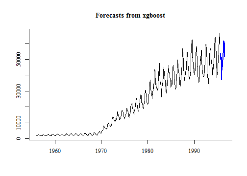
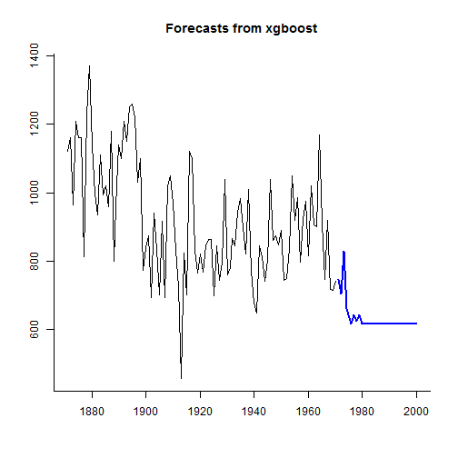
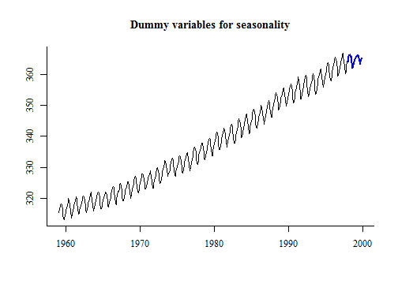
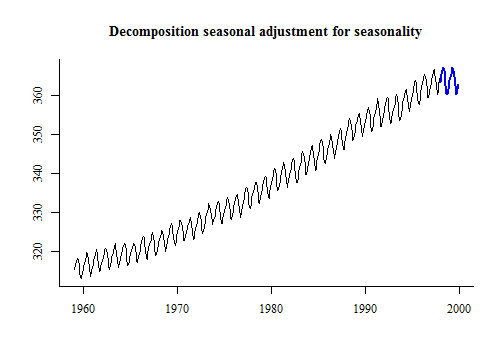
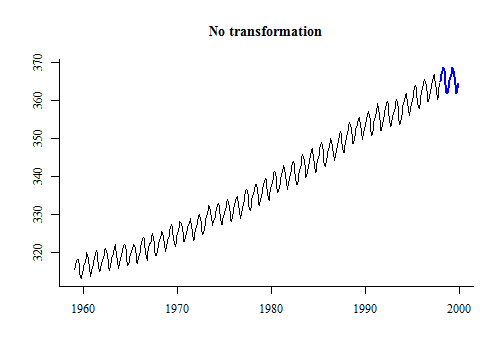
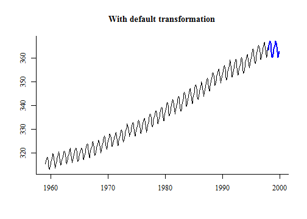

# forecastxgb-r-package
The `forecastxgb` package provides time series modelling and forecasting functions that combine the machine learning approach of Chen, He and Benesty's [`xgboost`](https://CRAN.R-project.org/package=xgboost) with the convenient handling of time series and familiar API of Rob Hyndman's [`forecast`](http://github.com/robjhyndman/forecast).  It applies to time series the Extreme Gradient Boosting proposed in [*Greedy Function Approximation: A Gradient Boosting Machine*, by Jermoe Friedman in 2001](http://www.jstor.org/stable/2699986). xgboost has become an important machine learning algorithm; nicely explained in [this accessible documentation](http://xgboost.readthedocs.io/en/latest/model.html).

[](https://travis-ci.org/ellisp/forecastxgb-r-package)
[](http://www.r-pkg.org/pkg/forecastxgb)
[](http://www.r-pkg.org/pkg/forecastxgb)

**Warning: this package is under active development and is some way off a CRAN release (realistically, no some time in 2017).  Currently the forecasting results with the default settings are, frankly, pretty rubbish, but there is hope I can get better settings.  The API and default values of arguments should be expected to continue to change.**

## Installation
Only on GitHub, but plan for a CRAN release in November 2016.  Comments and suggestions welcomed.

This implementation uses as explanatory features: 

* lagged values of the response variable
* dummy variables for seasons.
* current and lagged values of any external regressors supplied as `xreg`


```r
devtools::install_github("ellisp/forecastxgb-r-package/pkg")
```

## Usage


## Basic usage

The workhorse function is `xgbar`.  This fits a model to a time series.  Under the hood, it creates a matrix of explanatory variables based on lagged versions of the response time series, and (optionally) dummy variables of some sort for seasons.  That matrix is then fed as the feature set for `xgboost` to do its stuff.

### Univariate

Usage with default values is straightforward.  Here it is fit to Australian monthly gas production 1956-1995, an example dataset provided in `forecast`:

```r
library(forecastxgb)
model <- xgbar(gas)
```
(Note: the "Stopping. Best iteration..." to the screen is produced by `xgboost::xgb.cv`, which uses `cat()` rather than `message()` to print information on its processing.)

By default, `xgbar` uses row-wise cross-validation to determine the best number of rounds of iterations for the boosting algorithm without overfitting.  A final model is then fit on the full available dataset.  The relative importance of the various features in the model can be inspected by `importance_xgb()` or, more conveniently, the `summary` method for objects of class `xgbar`.


```r
summary(model)
```

```

Importance of features in the xgboost model:
    Feature         Gain        Cover   Frequency
 1:   lag12 5.097936e-01 0.1480752533 0.078475336
 2:   lag11 2.796867e-01 0.0731403763 0.042600897
 3:   lag13 1.043604e-01 0.0355137482 0.031390135
 4:   lag24 7.807860e-02 0.1320115774 0.069506726
 5:    lag1 1.579312e-02 0.1885383502 0.181614350
 6:   lag23 5.616290e-03 0.0471490593 0.042600897
 7:    lag9 2.510372e-03 0.0459623734 0.040358744
 8:    lag2 6.759874e-04 0.0436179450 0.053811659
 9:   lag14 5.874155e-04 0.0311432706 0.026905830
10:   lag10 5.467606e-04 0.0530535456 0.053811659
11:    lag6 3.820611e-04 0.0152243126 0.033632287
12:    lag4 2.188107e-04 0.0098697540 0.035874439
13:   lag22 2.162973e-04 0.0103617945 0.017937220
14:   lag16 2.042320e-04 0.0098118669 0.013452915
15:   lag21 1.962725e-04 0.0149638205 0.026905830
16:   lag18 1.810734e-04 0.0243994211 0.029147982
17:    lag3 1.709305e-04 0.0132850941 0.035874439
18:    lag5 1.439827e-04 0.0231837916 0.033632287
19:   lag15 1.313859e-04 0.0143560058 0.031390135
20:   lag17 1.239889e-04 0.0109696093 0.017937220
21: season7 1.049934e-04 0.0081041968 0.015695067
22:    lag8 9.773024e-05 0.0123299566 0.026905830
23:   lag19 7.733822e-05 0.0112879884 0.015695067
24:   lag20 5.425515e-05 0.0072648336 0.011210762
25:    lag7 3.772907e-05 0.0105354559 0.020179372
26: season4 4.067607e-06 0.0010709117 0.002242152
27: season5 2.863805e-06 0.0022286541 0.006726457
28: season6 2.628821e-06 0.0021707670 0.002242152
29: season9 9.226827e-08 0.0003762663 0.002242152
    Feature         Gain        Cover   Frequency

 35 features considered.
476 original observations.
452 effective observations after creating lagged features.
```
We see in the case of the gas data that the most important feature in explaining gas production is the production 12 months previously; and then other features decrease in importance from there but still have an impact.

Forecasting is the main purpose of this package, and a `forecast` method is supplied.  The resulting objects are of class `forecast` and familiar generic functions work with them.


```r
fc <- forecast(model, h = 12)
plot(fc)
```



Note that prediction intervals are not currently available.

See the vignette for more extended examples.

### With external regressors
External regressors can be added by using the `xreg` argument familiar from other forecast functions like `auto.arima` and `nnetar`.  `xreg` can be a vector or `ts` object but is easiest to integrate into the analysis if it is a matrix (even a matrix with one column) with well-chosen column names; that way feature names persist meaningfully.  

The example below, with data taken from the `fpp` package supporting Athanasopoulos and Hyndman's [Forecasting Principles and Practice](https://www.otexts.org/fpp) book, shows income being used to explain consumption.  In the same way that the response variable `y` is expanded into lagged versions of itself, each column in `xreg` is expanded into lagged versions, which are then treated as individual features for `xgboost`.


```r
library(fpp)
consumption <- usconsumption[ ,1]
income <- matrix(usconsumption[ ,2], dimnames = list(NULL, "Income"))
consumption_model <- xgbar(y = consumption, xreg = income)
summary(consumption_model)
```

```

Importance of features in the xgboost model:
        Feature        Gain       Cover   Frequency
 1:        lag2 0.253763903 0.082908446 0.124513619
 2:        lag1 0.219332682 0.114608734 0.171206226
 3: Income_lag0 0.115604367 0.183107958 0.085603113
 4:        lag3 0.064652150 0.093105742 0.089494163
 5:        lag8 0.055645114 0.099756152 0.066147860
 6: Income_lag8 0.050460959 0.049434715 0.050583658
 7: Income_lag1 0.047187235 0.088561295 0.050583658
 8: Income_lag6 0.040512834 0.029150964 0.050583658
 9:        lag6 0.031876878 0.044225227 0.054474708
10: Income_lag2 0.020355402 0.015739304 0.031128405
11: Income_lag5 0.018011250 0.036577256 0.035019455
12:        lag5 0.017930780 0.032143649 0.035019455
13:        lag7 0.016674036 0.034249612 0.027237354
14: Income_lag4 0.015952784 0.025714919 0.038910506
15: Income_lag7 0.009850701 0.021724673 0.019455253
16:        lag4 0.008819146 0.028929284 0.038910506
17: Income_lag3 0.008720737 0.013855021 0.019455253
18:     season4 0.003152234 0.001551762 0.003891051
19:     season3 0.001496807 0.004655287 0.007782101

 20 features considered.
164 original observations.
156 effective observations after creating lagged features.
```
We see that the two most important features explaining consumption are the two previous quarters' values of consumption; followed by the income in this quarter; and so on.


The challenge of using external regressors in a forecasting environment is that to forecast, you need values of the future external regressors.  One way this is sometimes done is by first forecasting the individual regressors.  In the example below we do this, making sure the data structure is the same as the original `xreg`.  When the new value of `xreg` is given to `forecast`, it forecasts forward the number of rows of the new `xreg`.  

```r
income_future <- matrix(forecast(xgbar(usconsumption[,2]), h = 10)$mean, 
                        dimnames = list(NULL, "Income"))
plot(forecast(consumption_model, xreg = income_future))
```



## Options

### Seasonality

Currently there are three methods of treating seasonality.  

- The current default method is to throw dummy variables for each season into the mix of features for `xgboost` to work with.  
- An alternative is to perform classic multiplicative seasonal adjustment on the series before feeding it to `xgboost`.   This seems to work better.
- A third option is to create a set of pairs of Fourier transform variables and use them as x regressors


```
No h provided so forecasting forward 24 periods.
```



```
No h provided so forecasting forward 24 periods.
```



```
No h provided so forecasting forward 24 periods.
```


All methods perform quite poorly at the moment, suffering from the difficulty the default settings have in dealing with non-stationary data (see below).

### Transformations

The data can be transformed by a modulus power transformation (as per John and Draper, 1980) before feeding to `xgboost`.  This transformation is similar to a Box-Cox transformation, but works with negative data.  Leaving the `lambda` parameter as 1 will effectively switch off this transformation.

```
No h provided so forecasting forward 24 periods.
```



```
No h provided so forecasting forward 24 periods.
```



Version 0.0.9 of `forecastxgb` gave `lambda` the default value of `BoxCox.lambda(abs(y))`.  This returned spectacularly bad forecasting results.  Forcing this to be between 0 and 1 helped a little, but still gave very bad results.  So far there isn't evidence (but neither is there enough investigation) that a Box Cox transformation helps xgbar do its model fitting at all.

### Non-stationarity
From experiments so far, it seems the basic idea of `xgboost` struggles in this context with extrapolation into a new range of variables not in the training set.  This suggests better results might be obtained by transforming the series into a stationary one before modelling - a similar approach to that taken by `forecast::auto.arima`.  This option is available by `trend_method = "differencing"` and seems to perform well - certainly better than without - and it will probably be made a default setting once more experience is available.


```r
model <- xgbar(AirPassengers, trend_method = "differencing", seas_method = "fourier")
plot(forecast(model, 24))
```


## Future developments
Future work might include: 

* additional automated time-dependent features (eg dummy variables for trading days, Easter, etc)
* ability to include xreg values that don't get lagged
* some kind of automated multiple variable forecasting, similar to a vector-autoregression.
* better choices of defaults for values such as `lambda` (for power transformations), `K` (for Fourier transforms) and, most likely to be effective, `maxlag`.
