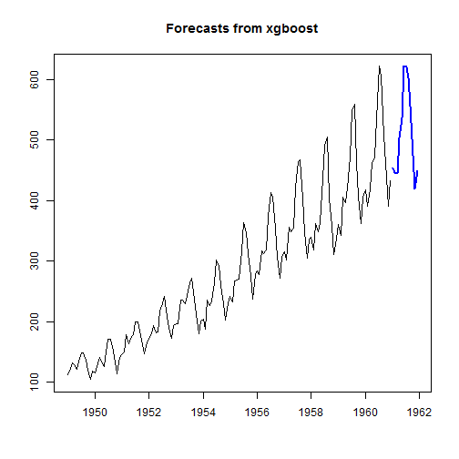
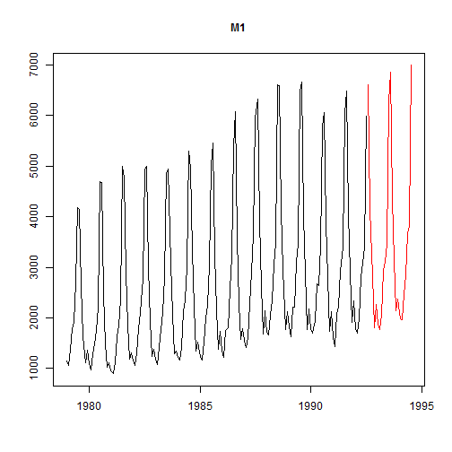
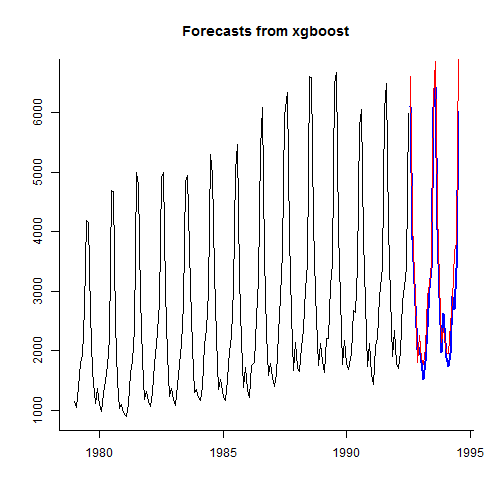

# forecastxgb-r-package
An R package for time series models and forecasts with xgboost compatible with {forecast} S3 classes

Only on GitHub.  Incomplete.  


```r
devtools::install_github("ellisp/forecastxgb-r-package/pkg")
```

## Usage
Seems to overfit rather severely, judging from the in-sample accuracy.  This is despite there being a cross-validation step:

```r
library(forecastxgb)
model <- xgbts(AirPassengers)
```

```
## Starting cross-validation
```

```
## Stopping. Best iteration: 81
```

```
## Fitting xgboost model
```

```r
fc <- forecast(model, h = 12)
accuracy(fc)
```

```
##                         ME        RMSE         MAE           MPE
## Training set -5.340576e-06 0.002635422 0.001948547 -1.488528e-05
##                      MAPE        MASE       ACF1
## Training set 0.0007087885 6.08345e-05 -0.2517086
```

```r
plot(fc)
```




## Tourism data example

```r
library(Tcomp)

thedata <- tourism[[1]]
plot(thedata)
```



```r
x <-thedata$x
h <- thedata$h

model <- xgbts(x)
```

```
## Starting cross-validation
```

```
## Stopping. Best iteration: 16
```

```
## Fitting xgboost model
```

```r
fc <- forecast(model, h = h)
plot(fc, bty = "l")
lines(thedata$xx, col = "red")
```



```r
accuracy(fc, thedata$xx)
```

```
##                     ME      RMSE       MAE      MPE     MAPE      MASE
## Training set  16.44529  40.36934  26.58402 0.492309 1.057617 0.1398889
## Test set     262.53091 393.97171 305.39539 7.215540 9.214990 1.6070336
##                    ACF1 Theil's U
## Training set 0.05805567        NA
## Test set     0.08914576 0.4090183
```

